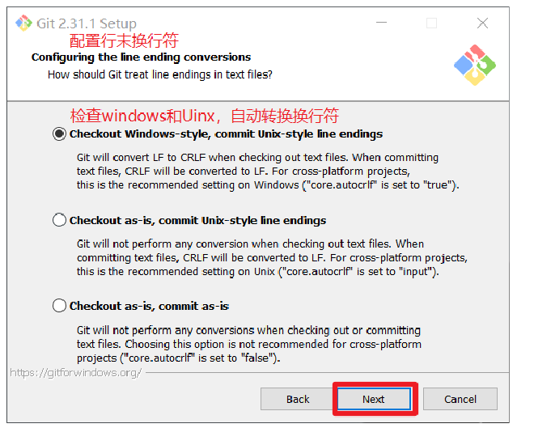
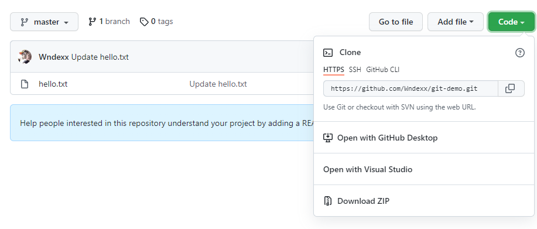
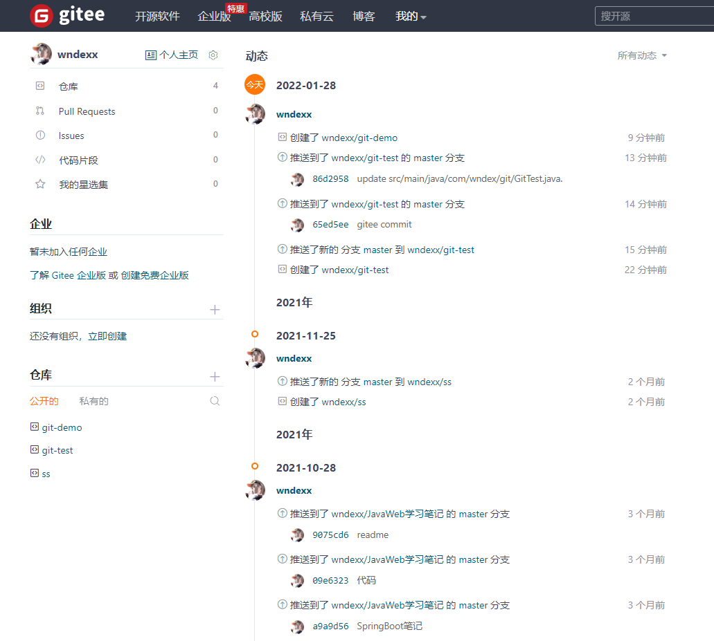

## Git

### 第1章	Git 概述

​	Git 是一个免费的、开源的==分布式版本控制系统==，可以快速高效地处理从小型到大型的各种项目

​	Git 易于学习，占地面积小，性能极快。它具有廉价的本地库，方便的暂存区域和多个工作流分支等特性。其性能优于 Subversion、CVS、Perforce 和 ClearCase 等版本控制工具

#### 1.1	什么是版本控制

​	版本控制是一种记录文件内容变化，以便将来查阅特定版本修订情况的系统

​	版本控制最重要的是可以==记录文件修改历史记录==，从而让用户能够查看历史版本，方便版本切换


#### 1.2	为什么需要版本控制

​	个人开发过渡到团队协作


#### 1.3	版本控制工具

###### 集中式版本控制工具

​	CVS、SVN（Subversion）、VSS...

​	集中化的版本控制系统诸如 CVS、SVN 等，都有一个==单一的集中管理的服务器==，保存所有文件的修订版本，而协同工作的人们都通过客户端连到这台服务器，取出最新的文件或者提交更新。多年以来，这已成为版本控制系统的标准做法。

​	这种做法带来了许多好处，每个人都可以在一定程度上看到项目中的其他人正在做些什么。而管理员也可以轻松掌控每个开发者的权限，并且管理一个集中化的版本控制系统，要远比在各个客户端上维护本地数据库来得轻松容易。

​	事分两面，有好有坏。这么做显而易见的缺点是==中央服务器的单点故障==。如果服务器宕机一小时，那么在这一小时内，谁都无法提交更新，也就无法协同工作。


###### 集中式版本控制

Git、Mercurial、Bazaar、Darcs...

像 Git 这种分布式版本控制工具，客户端提取的不是最新版本的文件快照，而是把代码仓库完整地镜像下来（本地库）。这样任何一处协同工作用的文件发生故障，事后都可以用其他客户端的本地仓库进行恢复。因为每个客户端的每一次文件提取操作，实际上都是一次对整个文件仓库的完整备份。

分布式的版本控制系统出现之后,解决了集中式版本控制系统的缺陷:

- 服务器断网的情况下也可以进行开发（因为版本控制是在本地进行的）
-  每个客户端保存的也都是整个完整的项目（包含历史记录，更加安全）


#### 1.4	Git 简史


#### 1.5	Git 工作机制


#### 1.6	Git 代码托管中心

代码托管中心是基于网络服务器的==远程代码仓库==，一般我们简单称为远程库。

- 局域网
  - GitLab
- 互联网
  - GitHub（外网）
  - Gitee（国内网站）


### 第2章	Git 安装

官网地址：https://git-scm.com

- 查看GNC 协议，默认


- 选择 Git 安装位置，要求是非中文并且没有空格的目录，然后下一步


- Git 选项配置，推荐默认设置，然后下一步


- Git 安装目录名，不用修改，直接点击下一步。


- Git 的默认编辑器，建议使用默认的 Vim 编辑器，然后点击下一步。


- 默认分支名设置，选择让 Git 决定，分支名默认为 master，下一步。


- 修改 Git 的环境变量，选第一个，不修改环境变量，只在 Git Bash 里使用 Git。


- 选择后台客户端连接协议，选默认值 OpenSSL，然后下一步


- 配置 Git 文件的行末换行符，Windows 使用 CRLF，Linux 使用 LF，选择第一个自动转换，然后继续下一步



- 选择 Git 终端类型，选择默认的 Git Bash 终端，然后继续下一步


- 选择 Git pull 合并的模式，选择默认，然后下一步


- 选择 Git 的凭据管理器，选择默认的跨平台的凭据管理器，然后下一步


- 其他配置，选择默认设置，然后下一步


- 实验室功能，技术还不成熟，有已知的 bug，不要勾选，然后点击右下角的 Install 按钮，开始安装 Git。


- 点击 Finsh 按钮，Git 安装成功！


- 右键任意位置，在右键菜单里选择 Git Bash Here 即可打开 Git Bash 命令行终端


- 在 Git Bash 终端里输入 git --version 查看 git 版本，如图所示，说明 Git 安装成功


### 第3章 Git 常见命令

| 命令名称                             | 作用             |
| ------------------------------------ | ---------------- |
| git config --global user.name 用户名 | 设置用户签名     |
| git config --global user.email 邮箱  | 设置用户签名     |
| git init                             | 初始化本地库     |
| git status                           | 查看本地库状态   |
| git add 文件名                       | 添加到暂存区     |
| git commit -m “日志信息” 文件名      | 提交到本地库     |
| git reflog                           | 查看历史记录     |
| git log                              | 查看完整历史记录 |
| git reset --hard 版本号              | 版本穿梭         |

```bash
# 常见的 Linux 命令
# cd 			改变目录
# cd .. 		回退到上一个目录，直接 cd 进入默认目录
# pwd 			显示当前所在的目录路径
# ls 或 ll 		列出当前目录中的所有文件，ll 列出的内容更为详细
# touch 		新建一个文件，例如 touch index.js 就会在当前目录下新建一个 index.js 文件
# rm			删除一个文件，rm index.js 就会把 index.js 文件删除
# mkdir			新建一个目录，就是新建一个文件夹
# rm -r			删除一个文件夹，rm -r src 删除 src 目录
# rm -rf		删除电脑中全部文件
# mv			mv index.html src,index.html 是要移动的文件，src 是目标文件夹，当然这样写必须保证文件和目标文件夹在同一目录下
# reset			重新初始化终端/清屏
# clear			清屏
# history		查看历史命令
# help			帮助
# exit			退出
# #				注释
# cat			查看文件内容，例如 cat hello.txt 就是查看 hello.txt 文件里面的内容
```

#### 3.1	设置用户签名

1. 基本语法

   ```shell
   git config --global user.name 用户名
   git config --global user.email 邮箱
   ```

   

2. 步骤

   全集范围的签名设置：

   ```shell
   Administrator@DESKTOP-5B8C6H3 MINGW64 /e/code/git-space/git-demo (master)
   $ git config --global user.name li
   
   Administrator@DESKTOP-5B8C6H3 MINGW64 /e/code/git-space/git-demo (master)
   $ git config --global user.email li@gmail.com
   ```

   说明：

   - 签名的作用
     - 区分不同操作者身份
     - 用户的签名信息在每个版本的提交信息中能够看到，以此确定本次提交者是谁
     - ==Git 首次安装必须设置用户签名，否则无法提交代码==
   - 注意
     - ==这里所设置的用户签名和将来登录 GitHub（或其他代码托管中心）的账号没有任何关系==


#### 3.2	 初始化本地库

1. 基本语法

   ```shell
   git init
   ```

   

2. 步骤

   ```shell
   Administrator@DESKTOP-5B8C6H3 MINGW64 /e/code/git-space/git-demo2
   $ git init
   Initialized empty Git repository in E:/code/git-space/git-demo2/.git/
   
   Administrator@DESKTOP-5B8C6H3 MINGW64 /e/code/git-space/git-demo2 (master)
   $ ll -a
   total 4
   drwxr-xr-x 1 Administrator 197121 0 Jan 26 15:54 ./
   drwxr-xr-x 1 Administrator 197121 0 Jan 26 15:54 ../
   drwxr-xr-x 1 Administrator 197121 0 Jan 26 15:54 .git/
   ```

   

3. 结果

   


#### 3.3	查看本地库状态

1. 基本语法

   ```shell
   # git status
   ```

   

2. 过程

   - 首次查看（工作区没有任何文件）

     ```shell
     Administrator@DESKTOP-5B8C6H3 MINGW64 /e/code/git-space/git-demo2 (master)
     $ git status
     On branch master		
     
     No commits yet
     
     nothing to commit (create/copy files and use "git add" to track)
     ```

   - 新增文件（hello.txt）

     ```shell
     Administrator@DESKTOP-5B8C6H3 MINGW64 /e/code/git-space/git-demo2 (master)
     $ vim hello.txt
     
     Administrator@DESKTOP-5B8C6H3 MINGW64 /e/code/git-space/git-demo2 (master)
     $ cat hello.txt
     hello git!
     hello git!
     hello git!
     hello git!
     hello git!
     hello git!
     hello git!
     hello git!
     hello git!
     hello git!
     hello git!
     ```

     ```shell
     # vim hello.txt 创建一个 hello.txt 文件并用 vim 打开
     # cat hello.txt 查看 hello.txt 文件内容
     # vim 快捷键
     #	yy  快速复制当前行
     #	p	粘贴
     #	i	编写模式
     #	esc 退出编写模式
     #	:wq	保存并退出
     ```

   - 再次查看（检测到未追踪的文件）

     ```shell
     Administrator@DESKTOP-5B8C6H3 MINGW64 /e/code/git-space/git-demo2 (master)
     $ git status
     On branch master
     
     No commits yet
     
     Untracked files:
       (use "git add <file>..." to include in what will be committed)
             hello.txt
     
     nothing added to commit but untracked files present (use "git add" to track)
     ```

     


#### 3.4	添加到暂存区

1. 基本语法

   ```shell
   git add 文件名
   ```

   

2. 步骤

   - 将工作区的文件添加到暂存区

     ```shell
     Administrator@DESKTOP-5B8C6H3 MINGW64 /e/code/git-space/git-demo2 (master)
     $ git add hello.txt
     warning: LF will be replaced by CRLF in hello.txt.
     The file will have its original line endings in your working directory
     ```

   - 查看状态（检测到暂存区有文件）

     ```shell
     Administrator@DESKTOP-5B8C6H3 MINGW64 /e/code/git-space/git-demo2 (master)
     $ git status
     On branch master
     
     No commits yet
     
     Changes to be committed:
       (use "git rm --cached <file>..." to unstage)
             new file:   hello.txt
     ```


#### 3.5	提交到本地库

1. 基本语法

   ```shell
   git commit -m "日志信息" 文件名
   ```

2. 步骤

   - 将暂存区的文件提交到本地库

     ```shell
     Administrator@DESKTOP-5B8C6H3 MINGW64 /e/code/git-space/git-demo2 (master)
     $ git commit -m "my first commit" hello.txt
     warning: LF will be replaced by CRLF in hello.txt.
     The file will have its original line endings in your working directory
     [master (root-commit) af9222d] my first commit
      1 file changed, 11 insertions(+)
      create mode 100644 hello.txt
     ```

   - 查看状态（没有文件需要提交）

     ```shell
     Administrator@DESKTOP-5B8C6H3 MINGW64 /e/code/git-space/git-demo2 (master)
     $ git status
     On branch master
     nothing to commit, working tree clean
     ```

   - 查看历史记录

     - 利用 `git reflog`

       ```shell
       Administrator@DESKTOP-5B8C6H3 MINGW64 /e/code/git-space/git-demo2 (master)
       $ git reflog
       af9222d (HEAD -> master) HEAD@{0}: commit (initial): my first commit
       ```

     - 利用 `git log`

       ```shell
       Administrator@DESKTOP-5B8C6H3 MINGW64 /e/code/git-space/git-demo2 (master)
       $ git log
       commit af9222d5f137825837e80819f4eec14ca832f9d1 (HEAD -> master)
       Author: li <li@gmail.com>
       Date:   Wed Jan 26 16:18:05 2022 +0800
       
           my first commit
       ```

       


#### 3.6	提交修改后的文件

1. 修改文件

   ```shell
   Administrator@DESKTOP-5B8C6H3 MINGW64 /e/code/git-space/git-demo (master)
   $ vim hello.txt
   
   Administrator@DESKTOP-5B8C6H3 MINGW64 /e/code/git-space/git-demo (master)
   $ cat hello.txt
   hello git! 2222
   hello git!
   hello git!
   hello git!
   hello git!
   hello git!
   hello git!
   hello git!
   hello git!
   hello git!
   hello git!
   ```

   

2. 查看状态（检测到工作区有文件被修改）

   ```shell
   Administrator@DESKTOP-5B8C6H3 MINGW64 /e/code/git-space/git-demo (master)
   $ git status
   On branch master
   Changes not staged for commit:
     (use "git add <file>..." to update what will be committed)
     (use "git restore <file>..." to discard changes in working directory)
           modified:   hello.txt	# gitshell 窗口里是红色
   
   no changes added to commit (use "git add" and/or "git commit -a")
   ```

   

3. 将修改的文件再次添加到暂存区

   ```shell
   Administrator@DESKTOP-5B8C6H3 MINGW64 /e/code/git-space/git-demo (master)
   $ git add hello.txt
   warning: LF will be replaced by CRLF in hello.txt.
   The file will have its original line endings in your working directory
   ```

   

4. 查看状态（工作区的修改添加到了暂存区）

   ```shell
   Administrator@DESKTOP-5B8C6H3 MINGW64 /e/code/git-space/git-demo (master)
   $ git status
   On branch master
   Changes to be committed:
     (use "git restore --staged <file>..." to unstage)
           modified:   hello.txt	# gitshell 窗口里是绿色
   ```

   

5. 将修改后的文件提交到本地库

   ```shell
   Administrator@DESKTOP-5B8C6H3 MINGW64 /e/code/git-space/git-demo (master)
   $ git commit -m "second commit" hello.txt
   warning: LF will be replaced by CRLF in hello.txt.
   The file will have its original line endings in your working directory
   [master 6128ad8] second commit
    1 file changed, 1 insertion(+), 1 deletion(-)
    # 注意
    # 		git 是按照 行 来维护文件的，如果修改了一行，会把原来的该行删掉，把修改的该行新增进来
   ```

   

6. 查看状态（暂存区的文件提交到了本地库）

   ```shell
   Administrator@DESKTOP-5B8C6H3 MINGW64 /e/code/git-space/git-demo (master)
   $ git status
   On branch master
   nothing to commit, working tree clean
   ```

   

7. 查看日志（HEAD 指向 second commit 版本）

   ```shell
   Administrator@DESKTOP-5B8C6H3 MINGW64 /e/code/git-space/git-demo (master)
   $ git reflog
   6128ad8 (HEAD -> master) HEAD@{0}: commit: second commit
   59608ff HEAD@{1}: commit (initial): first commit
   ```

   

8. 查看 hello.txt 文件（显示 second commit 版本的文件内容）

   ```shell
   Administrator@DESKTOP-5B8C6H3 MINGW64 /e/code/git-space/git-demo (master)
   $ cat hello.txt
   hello git! 2222
   hello git!
   hello git!
   hello git!
   hello git!
   hello git!
   hello git!
   hello git!
   hello git!
   hello git!
   hello git!
   ```

   


#### 3.7	历史版本

##### 3.7.1	查看历史版本

1. 基本语法

   ```shell
   git reflog  查看版本信息
   git log		查看版本详细信息
   ```

   

2. 步骤

   - `git reflog`

     ```shell
     Administrator@DESKTOP-5B8C6H3 MINGW64 /e/code/git-space/git-demo (master)
     $ git reflog
     068dfb9 (HEAD -> master) HEAD@{0}: commit: third commit
     6128ad8 HEAD@{1}: commit: second commit
     59608ff HEAD@{2}: commit (initial): first commit
     ```

     

   - `git log`

     ```shell
     Administrator@DESKTOP-5B8C6H3 MINGW64 /e/code/git-space/git-demo (master)
     $ git log
     commit 068dfb9346b6cb0065d819c2289ba4274fcddcbc (HEAD -> master)
     Author: li <li@gmail.com>
     Date:   Wed Jan 26 16:34:47 2022 +0800
     
         third commit
     
     commit 6128ad8dd72aa4515c14b5c25232c62cd1af5372
     Author: li <li@gmail.com>
     Date:   Wed Jan 26 16:29:52 2022 +0800
     
         second commit
     
     commit 59608ff28510e4c045c21945fffded285ebeee5e
     Author: Wndex <2377618180@qq.com>
     Date:   Wed Jan 26 15:16:40 2022 +0800
     
         first commit
     ```

     


##### 3.7.2	==版本穿梭==

1. 基本语法

   ```shell
   git reset --hard 版本号
   # 这里版本号可以是 简写的版本号 或 完整的版本号
   ```

   

2. 步骤

   ```shell
   # 查看历史记录，当前 master 指向 068dfb9 这个版本
   Administrator@DESKTOP-5B8C6H3 MINGW64 /e/code/git-space/git-demo (master)
   $ git reflog
   068dfb9 (HEAD -> master) HEAD@{0}: commit: third commit
   6128ad8 HEAD@{1}: commit: second commit
   59608ff HEAD@{2}: commit (initial): first commit
   
   # 切换到 6128ad8 版本
   Administrator@DESKTOP-5B8C6H3 MINGW64 /e/code/git-space/git-demo (master)
   $ git reset --hard 6128ad8
   HEAD is now at 6128ad8 second commit
   
   # 查看历史记录，当前 master 指向 6128ad8 这个版本
   Administrator@DESKTOP-5B8C6H3 MINGW64 /e/code/git-space/git-demo (master)
   $ git reflog
   6128ad8 (HEAD -> master) HEAD@{0}: reset: moving to 6128ad8
   068dfb9 HEAD@{1}: commit: third commit
   6128ad8 (HEAD -> master) HEAD@{2}: commit: second commit
   59608ff HEAD@{3}: commit (initial): first commit
   
   # 查看 hello.txt 文件，文件内容就是 6128ad8 提交的内容
   Administrator@DESKTOP-5B8C6H3 MINGW64 /e/code/git-space/git-demo (master)
   $ cat hello.txt
   hello git! 2222
   hello git!
   hello git!
   hello git!
   hello git!
   hello git!
   hello git!
   hello git!
   hello git!
   hello git!
   hello git!
   
   # 注意
   # 1. Git 切换版本，底层其实是移动的 HEAD 指针
   #    查看 .git 文件夹下的 HEAD 文件，为 ref: refs/heads/master ，即指向 master 分支
   #	 查看 .git -> refs -> heads -> master 文件，为 068dfb9346b6cb0065d819c2289ba4274fcddcbc ，即指向当前版本
   # 2. 切换版本后，工作区的文件切换到相应的版本
   ```

   


### 第 4 章	Git 分支操作


#### 4.1	什么是分支

​	在版本控制过程中，同时推进多个任务，可以创建每个任务的单独分支。

​	使用分支意味着程序员可以把自己的工作从开发主线上分离开来。开发自己分支的时候，不会影响主线分支的运行。

​	对于初学者而言，分支可以简单理解为副本，一个分支就是一个单独副本。（分支底层其实也是指针的引用）


#### 4.2	分支的好处

- 同时并行推进多个功能开发，提高开发效率
- 各个分支在开发过程中，如果某一个分支开发失败，不会对其他分支有任何影响。失败的分支删除重新开始即可。


#### 4.3	分支的操作

| 命令名称            | 作用                         |
| ------------------- | ---------------------------- |
| git branch 分支名   | 创建分支                     |
| git branch -v       | 查看分支                     |
| git checkout 分支名 | 切换分支                     |
| git meige 分支名    | 把指定的分支合并到当前分支上 |


##### 4.3.1	查看分支

1. 基本语法

   ```bash
   git branch -v
   ```

   

2. 步骤

   ```bash
   Administrator@DESKTOP-5B8C6H3 MINGW64 /e/code/git-space/git-demo (master)
   $ git branch -v
   * master  068dfb9 third commit # (* 代表当前所在的分区)
   ```


##### 4.3.2	创建分支 	

1. 基本语法

   ```bash
   git branch 分支名
   ```

   

2. 步骤

   ```bash
   Administrator@DESKTOP-5B8C6H3 MINGW64 /e/code/git-space/git-demo (master)
   $ git branch hot-fix
   
   Administrator@DESKTOP-5B8C6H3 MINGW64 /e/code/git-space/git-demo (master)
   $ git branch -v
     hot-fix 3c96aad hot-fix test # 新创建的分支，并将主分支 master 的内容复制了一份
   * master  598becb merge test
   ```

   


##### 4.3.3	切换分支

1. 基本语法

   ```bash
   git checkout 分支名
   ```

   

2. 步骤

   ```bash
   # 切换到 hot-fix 分支
   Administrator@DESKTOP-5B8C6H3 MINGW64 /e/code/git-space/git-demo (master)
   $ git checkout hot-fix
   Switched to branch 'hot-fix'
   
   ```

   

##### 4.3.4  修改分支

```bash
# 修改 hot-fix 分支上的 hello.txt 文件
Administrator@DESKTOP-5B8C6H3 MINGW64 /e/code/git-space/git-demo (hot-fix)
$ vim hello.txt

# 查看状态，hello.txt 文件需要提交
Administrator@DESKTOP-5B8C6H3 MINGW64 /e/code/git-space/git-demo (hot-fix)
$ git status
On branch hot-fix
Changes not staged for commit:
  (use "git add <file>..." to update what will be committed)
  (use "git restore <file>..." to discard changes in working directory)
        modified:   hello.txt

no changes added to commit (use "git add" and/or "git commit -a")

# 添加到暂存区
Administrator@DESKTOP-5B8C6H3 MINGW64 /e/code/git-space/git-demo (hot-fix)
$ git add hello.txt

Administrator@DESKTOP-5B8C6H3 MINGW64 /e/code/git-space/git-demo (hot-fix)
$ git status
On branch hot-fix
Changes to be committed:
  (use "git restore --staged <file>..." to unstage)
        modified:   hello.txt

# 提交到本地库
Administrator@DESKTOP-5B8C6H3 MINGW64 /e/code/git-space/git-demo (hot-fix)
$ git commit -m "hot-fix second commit" hello.txt
[hot-fix c4f1d09] hot-fix second commit
 1 file changed, 2 insertions(+), 2 deletions(-)
```


##### 4.3.5 合并分支（没有冲突）

1. 基本语法

   ```bash
   git merge 分支名
   ```

   

2. 步骤

   ```bash
   # 在 master 分支上合并 hot-fix 分支
   # 切换到 master 分支
   Administrator@DESKTOP-5B8C6H3 MINGW64 /e/code/git-space/git-demo (hot-fix)
   $ git checkout master
   Switched to branch 'master'
   
   # 查看 hello.txt 文件
   Administrator@DESKTOP-5B8C6H3 MINGW64 /e/code/git-space/git-demo (master)
   $ cat hello.txt
   hello git! 2222
   hello git! 3333
   hello git!
   hello git!
   hello git!
   hello git!
   hello git!
   hello git!
   hello git!
   hello git!
   hello git!
   
   # 合并 hot-fix 分支
   # 因为 master 分支之前没有修改过，所以可以直接合并
   Administrator@DESKTOP-5B8C6H3 MINGW64 /e/code/git-space/git-demo (master)
   $ git merge hot-fix
   Updating 068dfb9..c4f1d09
   Fast-forward
    hello.txt | 4 ++--
    1 file changed, 2 insertions(+), 2 deletions(-)
    
   # 查看 hello.txt 文件
   Administrator@DESKTOP-5B8C6H3 MINGW64 /e/code/git-space/git-demo (master)
   $ cat hello.txt
   hello git! 222
   hello git! 333
   hello git!
   hello git!
   hello git!
   hello git!
   hello git!
   hello git!
   hello git!
   hello git!
   hello git!
   ```

   


##### 4.3.6 产生冲突

​	合并分支时，两个分支在同一个文件的同一个位置有两套完全不同的修改。Git 无法替我们决定使用哪一个。必须人为决定新代码内容

1. 修改 master 分支下的 hello.txt 

   ```bash
   Administrator@DESKTOP-5B8C6H3 MINGW64 /e/code/git-space/git-demo (master)
   $ vim hello.txt
   
   Administrator@DESKTOP-5B8C6H3 MINGW64 /e/code/git-space/git-demo (master)
   $ git add hello.txt
   
   Administrator@DESKTOP-5B8C6H3 MINGW64 /e/code/git-space/git-demo (master)
   $ git commit -m "master test" hello.txt
   [master 22ee42f] master test
    1 file changed, 1 insertion(+), 1 deletion(-)
   
   Administrator@DESKTOP-5B8C6H3 MINGW64 /e/code/git-space/git-demo (master)
   $ cat hello.txt
   hello git! 222
   hello git! 333
   hello git!
   hello git!
   hello git!
   hello git!
   hello git!
   hello git!
   hello git!
   hello git! master test
   hello git!
   ```

   

2. 修改 hot-fix 分支下的 hello.txt

   ```bash
   Administrator@DESKTOP-5B8C6H3 MINGW64 /e/code/git-space/git-demo (master)
   $ git checkout hot-fix
   Switched to branch 'hot-fix'
   
   Administrator@DESKTOP-5B8C6H3 MINGW64 /e/code/git-space/git-demo (hot-fix)
   $ vim hello.txt
   
   Administrator@DESKTOP-5B8C6H3 MINGW64 /e/code/git-space/git-demo (hot-fix)
   $ git add hello.txt
   
   Administrator@DESKTOP-5B8C6H3 MINGW64 /e/code/git-space/git-demo (hot-fix)
   $ get commit -m "hot-fix test" hello.txt
   bash: get: command not found
   
   Administrator@DESKTOP-5B8C6H3 MINGW64 /e/code/git-space/git-demo (hot-fix)
   $ git commit -m "hot-fix test" hello.txt
   [hot-fix 3c96aad] hot-fix test
    1 file changed, 1 insertion(+), 1 deletion(-)
   
   Administrator@DESKTOP-5B8C6H3 MINGW64 /e/code/git-space/git-demo (hot-fix)
   $ cat hello.txt
   hello git! 222
   hello git! 333
   hello git!
   hello git!
   hello git!
   hello git!
   hello git!
   hello git!
   hello git!
   hello git! 
   hello git! hot-fix test
   ```

   

3. 合并分支

   ```bash
   # 此时产生冲突
   Administrator@DESKTOP-5B8C6H3 MINGW64 /e/code/git-space/git-demo (master)
   $ git merge hot-fix
   Auto-merging hello.txt
   CONFLICT (content): Merge conflict in hello.txt
   Automatic merge failed; fix conflicts and then commit the result.
   
   # 冲突的表现：master|MERGING
   Administrator@DESKTOP-5B8C6H3 MINGW64 /e/code/git-space/git-demo (master|MERGING)
   $ git status
   On branch master
   You have unmerged paths.
     (fix conflicts and run "git commit")
     (use "git merge --abort" to abort the merge)
   
   Unmerged paths:
     (use "git add <file>..." to mark resolution)
           both modified:   hello.txt
   
   no changes added to commit (use "git add" and/or "git commit -a")
   
   ```

   

4. 解决冲突（人为修改）

   - 编辑有冲突的文件，删除特殊符号，决定要使用的内容

     特殊符号：<<<<<<< HEAD 当前分支的代码 ============== 合并过来的代码 >>>>>>> hot-fix

     ```bash
     hello git! 222
     hello git! 333
     hello git!
     hello git!
     hello git!
     hello git!
     hello git!
     hello git!
     hello git!
     hello git! 
     <<<<<<< HEAD
     hello git! master test
     hello git!
     =======
     hello git!
     hello git! hot-fix test
     >>>>>>> hot-fix
     ```

   - 编辑后的文件

     ```bash
     hello git! 222
     hello git! 333
     hello git!
     hello git!
     hello git!
     hello git!
     hello git!
     hello git!
     hello git!
     hello git! 
     hello git! master test
     hello git! hot-fix test
     ```

   - 添加到暂存区

     ```bash
     Administrator@DESKTOP-5B8C6H3 MINGW64 /e/code/git-space/git-demo (master|MERGING)
     $ git add hello.txt
     ```

   - 提交到本地库（注意此时使用 `git commit` 命令时不能带文件名）

     ```bash
     Administrator@DESKTOP-5B8C6H3 MINGW64 /e/code/git-space/git-demo (master|MERGING)
     $ git commit -m "merge test"
     [master 598becb] merge test
     
     Administrator@DESKTOP-5B8C6H3 MINGW64 /e/code/git-space/git-demo (master)
     $ cat hello.txt
     hello git! 222
     hello git! 333
     hello git!
     hello git!
     hello git!
     hello git!
     hello git!
     hello git!
     hello git!
     hello git! master test
     hello git! hot-fox test
     ```

     

     master、hot-fix 其实都是指向具体版本记录的指针。当前所在的分支，其实是由 HEAD 决定的。所以创建分支的本质就是多创建一个指针。

     HEAD 如果指向 master，那么我们现在就在 master 分支上

     HEAD 如果执行 hotfix，那么我们现在就在 hotfix 分支上

     所以切换分支的本质就是移动 HEAD 指针


### 第 5 章	Git 团队协作机制

#### 5.1	团队内协作


#### 5.2	跨团队协作


### 第 6 章 GitHub 操作

GitHub 网址：https://github.com/


#### 6.1	创建远程仓库


#### 6.2	远程仓库操作

| 命令名称                           | 作用                                                     |
| ---------------------------------- | -------------------------------------------------------- |
| git remote -v                      | 查看当前所有远程地址别名                                 |
| git remote add 别名 远程地址       | 给远程仓库起别名                                         |
| git push 别名 分支                 | 推送本地分支上的内容到远程仓库                           |
| git clone 远程地址                 | 将远程仓库的内容克隆到本地                               |
| git pull 远程库地址别名 远程分支名 | 将远程仓库对应分支最新内容拉下来后与当前本地分支直接合并 |

##### 6.2.1	创建远程仓库别名

1. 基本语法

   ```bash
   git remote -v 					查看当前远程地址别名
   git remote add 别名 远程地址 		 给远程仓库起别名 
   ```

   

2. 步骤

   ```bash
   # 查看远程仓库别名，当前没有
   Administrator@DESKTOP-5B8C6H3 MINGW64 /e/code/git-space/git-demo (master)
   $ git remote -v
   
   # 给 https://github.com/Wndexx/git-demo.git 远程仓库起别名 git-demo
   Administrator@DESKTOP-5B8C6H3 MINGW64 /e/code/git-space/git-demo (master)
   $ git remote add git-demo https://github.com/Wndexx/git-demo.git
   
   # 再次查看元u昵称仓库别名
   Administrator@DESKTOP-5B8C6H3 MINGW64 /e/code/git-space/git-demo (master)
   $ git remote -v
   # 该行表示 该别名 可以用来拉取
   git-demo        https://github.com/Wndexx/git-demo.git (fetch)
   # 该行表示 该别名 可以用来推送
   git-demo        https://github.com/Wndexx/git-demo.git (push)
   ```

   


##### 6.2.2	推送本地分支到远程仓库

1. 基本语法

   ```bash
   git push 别名 分支
   ```

   

2. 步骤

   ```bash
   Administrator@DESKTOP-5B8C6H3 MINGW64 /e/code/git-space/git-demo (master)
   $ git push git-demo master
   Enumerating objects: 3, done.
   Counting objects: 100% (3/3), done.
   Writing objects: 100% (3/3), 219 bytes | 219.00 KiB/s, done.
   Total 3 (delta 0), reused 0 (delta 0), pack-reused 0
   To https://github.com/Wndexx/git-demo.git
    * [new branch]      master -> master
   ```

   


##### 6.2.3	克隆远程仓库到本地

1. 基本语法

   ```bash
   git clone 远程地址
   ```

   

2. 步骤

   ```bash
   Administrator@DESKTOP-5B8C6H3 MINGW64 /e/code/git-space/1111
   $ git clone https://github.com/Wndexx/git-demo.git
   Cloning into 'git-demo'...
   remote: Enumerating objects: 3, done.
   remote: Counting objects: 100% (3/3), done.
   remote: Total 3 (delta 0), reused 3 (delta 0), pack-reused 0
   Receiving objects: 100% (3/3), done.
   ```

   https://github.com/Wndexx/git-demo.git

   这个地址为远程仓库地址，克隆结果：初始化本地仓库


```bash
Administrator@DESKTOP-5B8C6H3 MINGW64 /e/code/git-space/1111
$ cd git-demo

Administrator@DESKTOP-5B8C6H3 MINGW64 /e/code/git-space/1111/git-demo (master)
$ git remote -v
# 自动给远程仓库起了别名，默认为 origin 
origin  https://github.com/Wndexx/git-demo.git (fetch)
origin  https://github.com/Wndexx/git-demo.git (push)
```


小结：clone 会做如下操作。1、拉取代码	2、初始化本地仓库	3、创建别名


##### 6.2.4	拉取远程仓库分支到本地

1. 基本语法

   ```bash
   git pull 远程库地址别名 远程分支名
   ```

   

2. 步骤

   ```bash
   Administrator@DESKTOP-5B8C6H3 MINGW64 /e/code/git-space/git-demo (master)
   $ git pull git-demo master
   remote: Enumerating objects: 5, done.
   remote: Counting objects: 100% (5/5), done.
   remote: Total 3 (delta 0), reused 0 (delta 0), pack-reused 0
   Unpacking objects: 100% (3/3), 625 bytes | 52.00 KiB/s, done.
   From https://github.com/Wndexx/git-demo
    * branch            master     -> FETCH_HEAD
      a65e368..77f1ec5  master     -> git-demo/master
   Updating a65e368..77f1ec5
   Fast-forward
    hello.txt | 1 +
    1 file changed, 1 insertion(+)
   
   Administrator@DESKTOP-5B8C6H3 MINGW64 /e/code/git-space/git-demo (master)
   $ cat hello.txt
   hello git!
   hello git!!
   ```

   


##### 6.2.5	邀请加入团队

1. 选择邀请合作者


2. 选择想要合作的人


3. 复 制 地 址 并 通 过 微 信 钉 钉 等 方 式 发 送 给 该 用 户


4. 在 atguigulinghuchong 这个账号中的地址栏复制收到邀请的链接，点击接受邀请


5. 成功之后可以在 atguigulinghuchong 这个账号上看到 相应的远程仓库


6. 被邀请用户可以修改内容并 push 到远程仓库


7. 回到 Wndex 的 GitHub 远程仓库中可以看到，最后一次是 lhc 提交的。


#### 6.3	跨团队协作

1. 将远程仓库的地址复制发给邀请跨团队协作的人




2. 在受邀方的 GitHub 账号里的地址栏复制收到的链接，然后点击 Fork 将项目叉到自己的本地仓库。


叉入中...


叉成功后可以看到当前仓库信息


3. 受邀方就可以在线编辑叉取过来的文件


4. 编辑完毕后，填写描述信息并点击左下角绿色按钮提交


5. 接下来点击上方的 Pull 请求，并创建一个新的请求


6. 回到邀请方 GitHub 账号可以看到有一个 Pull request 请求。


进入到聊天室，可以讨论代码相关内容


7. 如果代码没有问题，可以点击 Merge pull reque 合并代码


#### 6.4	SSH 免密登录

远程仓库中还有一个 SSH 的地址，因此也可以使用 SSH 进行访问


1. 步骤

   ```bash
   # 进入当前用户家目录
   Administrator@DESKTOP-5B8C6H3 MINGW64 /e/code/git-space/git-demo (master)
   $ cd
   
   # 删除 .ssh 目录
   Administrator@DESKTOP-5B8C6H3 MINGW64 ~
   $ rm -rvf .ssh
   removed '.ssh/known_hosts'
   removed directory '.ssh'
   
   # 运行命令生成 .ssh 密钥目录（注意：这里 -C 这个参数是大写的 C）
   Administrator@DESKTOP-5B8C6H3 MINGW64 ~
   $ ssh-keygen -t rsa -C 2377618180@qq.com
   Generating public/private rsa key pair.
   Enter file in which to save the key (/c/Users/Administrator/.ssh/id_rsa):
   Created directory '/c/Users/Administrator/.ssh'.
   Enter passphrase (empty for no passphrase):
   Enter same passphrase again:
   Your identification has been saved in /c/Users/Administrator/.ssh/id_rsa
   Your public key has been saved in /c/Users/Administrator/.ssh/id_rsa.pub
   The key fingerprint is:
   SHA256:MDf+oVS3CaxRw1c1QG1xEIkg848WbqEZ9LhObl/jCNA 2377618180@qq.com
   The key's randomart image is:
   +---[RSA 3072]----+
   |        +.+..=*B+|
   |       . O..o .oo|
   |      o * O.. .  |
   |       * @ B o   |
   |      . E * +    |
   |       * = .     |
   |        * . o    |
   |       . o + .   |
   |          o .    |
   +----[SHA256]-----+
   
   # 进入 .ssh 目录查看文件列表
   Administrator@DESKTOP-5B8C6H3 MINGW64 ~
   $ cd .ssh
   
   Administrator@DESKTOP-5B8C6H3 MINGW64 ~/.ssh
   $ ll -a
   total 17
   drwxr-xr-x 1 Administrator 197121    0 Jan 27 16:16 ./
   drwxr-xr-x 1 Administrator 197121    0 Jan 27 16:16 ../
   -rw-r--r-- 1 Administrator 197121 2602 Jan 27 16:16 id_rsa
   -rw-r--r-- 1 Administrator 197121  571 Jan 27 16:16 id_rsa.pub
   
   Administrator@DESKTOP-5B8C6H3 MINGW64 ~/.ssh
   $ cat id_rsa.pub
   ssh-rsa AAAAB3NzaC1yc2EAAAADAQABAAABgQDVWww1SYsJ/7iqCECQHYRTl3RANjLGT6FnJnqxLUM8LKS8JuxDuv4QKEZllj3ejWeFdgNLsanhwbtIazd4+CzunG6AMDWifkDy+GzvqpGE7PR2VkkF1kRiE6Dd13x4Y2LDpLVhv61shdyVNEPugaATNnvkz42u8YzkYXVSkDTzsyVaK+V4ElEUHaWf9Tcy3rbz3Kr5/oNFnKYZNkcHhRnhcc+q3m+THP08rCvXcD99rF00ue/z2MQvy+fTZzTW9XF7lS49b9TS9sWXb2xqQKqi6f9IOt0afGZ02S+xha+qOtD7VQJ1hbbNIm7PJHD2IIk3eNtK0GTuR4tkD+gnAZeBbVZkC2YOm0owjxr3i+SmPOiobwWk21e5dTj7l1GZuBViLlJuFxCE7mhKhMWDT5ePGmPzp+LFTEBEqBQ5iw3bCL2Md9CorzwS9JUiEWZb+oX+ZuUbne4yzhv9xnxHB/729X3IC1LV/eGyC+iVhE5F5nDeeBD4qjHhOnZTiH1+k2k= 2377618180@qq.com
   ```

   复制 id_rsa.pub 文件内容，登录 GitHub，点击用户头像 -> Settings -> SSH and GPR keys


接下来再往远程仓库 push 东西的时候使用 SSH 连接就不需要登录了


### 第 7 章	IDEA 集成 Git

#### 7.1	配置 Git 忽略文件

1. Eclipse 特定文件


2. IDEA 特定文件


3. Maven 工程的 target 目录


问题1：问什么要忽略它们？

答：与项目的实际功能无关，不参于服务器上部署运行，把它们忽略掉能够屏蔽 IDEA 工具之间的差异

问题2：怎么忽略？

- 创建忽略规则 xxxx.ignore（前缀名随便起，建议是 git.ignore）

  这个文件的存放位置原则上在哪里都可以，为了便于让 ~/.gitconfig 文件引用，建议也放在用户家目录下

  git.ignore 文件的模板内容如下：

  ```properties
  # Compiled class file
  *.class
  
  # Log file
  *.log
  
  # BlueJ files
  *.ctxt
  
  # Mobile Tools for Java(J2ME)
  .mtj.tmp/
  
  # Package Files #
  *.jar
  *.war
  *.nar
  *.ear
  *.zip
  *.tar.gz
  *.rar
  
  # virtual machine crash logs,see http://java.com/en/download/help/error_hotspor.xml
  hs_err_pid*
  
  .classpath
  .project
  .settings
  target
  .idea
  *.iml
  ```

- 在 .gitconfig 文件中引用忽略配置文件（此文件在 Windows 的家目录中）

  ```properties
  [user]
  	name = Wndexx
  	email = 2377618180@qq.com
  [core]
  	excludesfile = C:/Users/Administrator/git.ignore
  	# 注意：这里要使用 "正斜线（/）"，不要使用 "反斜线（\）"
  ```

  


#### 7.2	定位 Git 程序


#### 7.3	初始化本地库


#### 7.4	添加到本地库

快捷键：ctrl + alt + A


红色文件代表未添加到暂存区，绿色代表未提交到本地库


#### 7.5	提交到本地库


#### 7.6	切换版本


#### 7.7	创建分支


#### 7.8	切换分支


#### 7.9	合并分支


如果代码没有冲突，分支直接合并成功，分支合并成功以后，代码自动提交，无序手动提交本地库


#### 7.10	解决冲突

如果 master 和 hot-fix 分支都修改了代码，在合并分支的时候就会发生冲突


我们现在站在 master 分支上合并 hot-fix 分支，就会发生代码冲突


点击 Conflicts 框里的 Merge 按钮，进行手动合并代码


手动合并完代码以后，点击右下角的 Apply 按钮


代码冲突解决，自动提交本地库


### 第 8 章 IDEA 集成 GitHub


#### 8.1	设置 GitHub 账号


或通过 token 连接


#### 8.2	分享工程到 GitHub


#### 8.3	push 推送本地库到远程库

默认通过 https 推送


或通过 ssh 推送


​	注意：push 是将本地库代码推送到远程库，如果本地库代码跟远程库代码版本不一致，push 的操作是会被拒绝的。也就是说，要想 push 成功，==一定要保证本地库的版本要比远程库的版本高==！因此一个成熟的程序员在动手改本地代码之前，一定会先检查下远程库跟本地代码的区别！如果本地的代码版本已经落后，切记要==先 pull==拉取一下远程库的代码，将本地代码更新到最新以后，然后再修改，提交，推送


#### 8.4	pull 拉取远程库到本地库


或


注意：pull 是拉取远端仓库代码到本地，如果远程库代码和本地库代码不一致，会自动合并，如果自动合并失败，还会涉及到手动解决冲突的问题。


#### 8.5	clone 克隆远程库到本地


或


### 第 9 章	国内代码托管中心-码云

#### 9.1	简介

​	众所周知，GitHub 服务器在国外，使用 GitHub 作为项目托管网站，如果网速不好的话，严重影响使用体验，甚至会出现登录不上的情况。针对这个情况，大家也可以使用国内的项目托管网站-码云。

​	码云是开源中国推出的基于 Git 的代码托管服务中心，网址是 https://gitee.com/ ，使用方式跟 GitHub 一样，而且它还是一个中文网站，如果你英文不是很好它是最好的选择


#### 9.2	码云帐号注册和登录

​	进入码云官网地址：https://gitee.com/，点击注册 Gitee


​	输入个人信息，进行注册即可


帐号注册成功以后，直接登录。


登录以后，就可以看到码云官网首页了




#### 9.3	码云创建远程库

点击首页右上角的加号，选择下面的新建仓库


远程库创建好以后，就可以看到 HTTPS 和 SSH 的链接。


#### 9.4	IDEA 集成 码云

##### 9.4.1	IDEA 安装码云插件

Idea 默认不带码云插件，我们第一步要安装 Gitee 插件。

如图所示，在 Idea 插件商店搜索 Gitee，然后点击右侧的 Install 按钮。


Idea 重启以后在 Version Control 设置里面看到 Gitee，说明码云插件安装成功


然后在码云插件里面添加码云帐号，我们就可以用 Idea 连接码云了


##### 9.4.2	IDEA 连接码云

​	Idea 连接码云和连接 GitHub 几乎一样，首先在 Idea 里面创建一个工程，初始化 git 工程，然后将代码添加到暂存区，提交到本地库，这些步骤上面已经讲过，此处不再赘述

- 将本地代码 push 到码云远程库


​		自定义远程库链接，云服务器在国内，用 HTTPS 链接即可，没必要用 SSH 免密链接。


​		然后选择定义好的远程链接，点击 Push 即可


只要码云远程库链接定义好以后，对码云远程库进行 pull 和 clone 的操作和 Github 一致，此处不再赘述。


#### 9.5 码云复制 GitHub 项目


### 第 10 章 自建代码托管平台-GitLab


补充

```bash
git rm --cached "文件路径"，不删除物理文件，仅将该文件从缓存中删除；
 
git rm --f "文件路径"，不仅将该文件从缓存中删除，还会将物理文件删除（不会回收到垃圾桶）


git add -u  等价于 git add –update
提交所有被删除和修改的文件到数据暂存区

git add .（对删除无效）
提交所有修改的和新建的数据暂存区

git add -A   等价于  git add –all
提交所有被删除、被替换、被修改和新增的文件到数据暂存区

git remote rename 原别名 新别名
```


